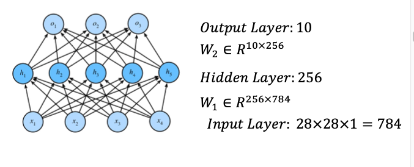

## 1、基础部分吗
根目录下的ch_base_01 - 06 是一些pytorch的基础，还有一些方法的 案例

## 2、资料
### 实验一 ML
https://blog.csdn.net/weixin_41939870/article/details/120611800
pytorch实现基本的logistic和softmax回归实验（手动+torch）：https://blog.csdn.net/qq_37534947/article/details/108179408
### 实验二 FNN
手动以及使用torch.nn实现前馈神经网络实验（best）：https://blog.csdn.net/m0_52910424/article/details/127819278
RMSprop/momentum/adam/L2正则化/dropout/早停机制 等优化算法：https://blog.csdn.net/m0_52910424/article/details/132364542

### 实验三 CNN
CNN:https://blog.csdn.net/m0_52910424/article/details/132364919

## 2、实验0 
这是课件实验0 上面的案例，主要是一些torch的使用和一些包函数的使用

## 3、实验1
使用机器学习的三大基础：模型、学习准则（损失函数）、优化算法（大多都是梯度下降）
三大实验：线性回归实验、二分类（sigmoid）实验、多分类（softmax）实验
实验1 是通过机器学习的方式 分别使用 手动 和 torch.nn 来进行实现这三个实验。
线性回归实验是课件上的：
    ch_expriment_1_01.py ：借助资料：https://blog.csdn.net/weixin_41939870/article/details/120611800
    ch_expriment_1_02.py
sigmoid和softmax 是课后作业：
    homework_02.py      ： 借助资料（下面都是这个）：https://blog.csdn.net/qq_37534947/article/details/108179408
    homework_03.py
    homework_04.py
    homework_05.py

# 4、实验2:FNN 前馈神经网络

手动实现FNN的损失结果图

torch.nn 实现 FNN 损失结果图

# git 使用
1、git init 或者 初始化创建后 为红色
2、git add . 为绿色
3、